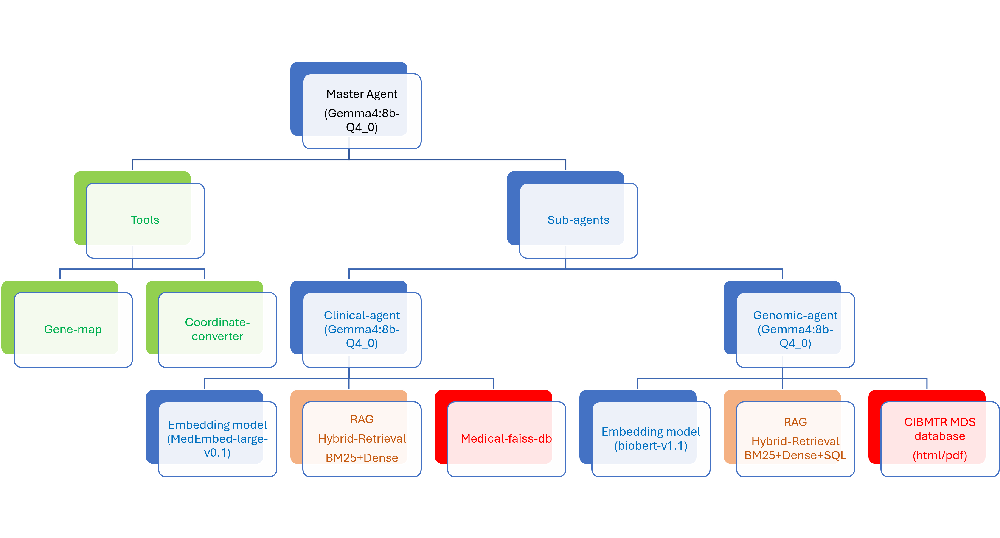
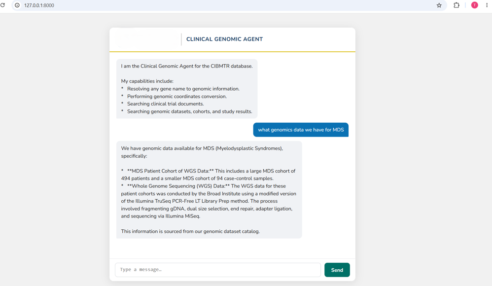

# Clinical Genomic Agent

A FastAPI-based ReAct agent for the CIBMTR database that answers clinical and genomic questions through a hybrid retrieval pipeline. It exposes a web chat UI and a WhatsApp webhook, and runs fully locally using a quantised Gemma model via llama.cpp.

---

## Architecture



**LLM:** `gemma-4-E2B-it-Q4_0` served by llama.cpp on port 8080 (OpenAI-compatible API).  
**Embedding models:** `MedEmbed-large-v0.1` (clinical), `Sentence-BioBert-snli` (genomic).

---

## Tools

| Tool | Description |
|------|-------------|
| `clinical_search` | Two-stage BM25 → dense re-ranking over a FAISS medical document store |
| `genomic_search` | SQL + BM25 + vector RRF over a DuckDB genomic knowledge catalog |
| `gene_map_tools` | Looks up gene metadata from the dbNSFP4.0 gene table |
| `github_tools` | GitHub MCP server tools (via `mcp_servers.json`) |

---

## Project Structure

```
clinical_genomic_agent/
├── server.py                  # FastAPI app + agent initialisation
├── agent.md                   # System prompt / agent persona
├── mcp_client.py              # MultiServerMCPClient builder
├── mcp_servers.json           # MCP server config (local)
├── mcp_servers_docker.json    # MCP server config (Docker)
├── activity_logger.py         # Request/response activity logging
├── subagents/
│   ├── clinical_agent.py      # ClinicalSubAgent (BM25 + dense)
│   ├── genomic_hybrid_agent.py# GenomicSubAgent (SQL + BM25 + FAISS)
│   └── __init__.py
├── tools/
│   ├── digest_genomic_pdf.py  # PDF → DuckDB/BM25/FAISS ingestion pipeline
│   └── genomic_digest_biobert/# Pre-built genomic indexes
│       ├── genomic_knowledge.duckdb
│       ├── bm25_entities.json
│       └── faiss_index/
├── skills/                    # Per-tool skill markdown injected into prompts
├── static/                    # Web chat UI (index.html)
├── MedEmbed-large-v0.1/       # Clinical embedding model (local)
├── Sentence-BioBert-snli/     # Genomic embedding model (local)
├── medical-faiss-db/          # Pre-built clinical FAISS index
├── gemma-4-E2B-it-GGUF/       # Quantised LLM weights
├── logs/                      # Activity logs (JSONL)
├── Dockerfile
├── docker-compose.yml
└── requirements_docker.txt
```

---

## Quick Start

### Docker (recommended)

```bash
# Place your model weights in gemma-4-E2B-it-GGUF/ then:
docker compose up --build
```

Services started:
- `llama` — llama.cpp server on port 8080 (main agent LLM, 128k context)
- `llama2` — llama.cpp server on port 8081 (genomic sub-agent planner, GPU)
- `agent` — FastAPI app on port 8000

Open `http://localhost:8000` for the chat UI.

### Local (without Docker)

```bash
pip install -r requirements_docker.txt

# Start llama.cpp server separately, then:
uvicorn server:app --host 0.0.0.0 --port 8000
```


---

## Configuration

### `api_key.json`

Create this file in the project root:

```json
{
  "OPENAI_API_KEY": "<key>",
  "GITHUB_PAT": "<token>",
  "tavilyApiKey": "<key>",
  "youApiKey": "<key>",
  "WHATSAPP_TOKEN": "<meta-token>",
  "WHATSAPP_PHONE_ID": "<phone-id>",
  "WEBHOOK_VERIFY_TOKEN": "<any-string>"
}
```

### Environment variables (Docker)

| Variable | Default | Purpose |
|----------|---------|---------|
| `LLAMA_SERVER_URL` | `http://llama:8080/v1` | Main LLM endpoint |
| `LLAMA2_SERVER_URL` | `http://llama2:8081/v1` | Genomic planner LLM endpoint |
| `DEVICE` | `cpu` | Torch device for clinical embeddings |
| `GENOMIC_DB` | `tools/genomic_digest_biobert/genomic_knowledge.duckdb` | DuckDB catalog |
| `GENOMIC_FAISS` | `tools/genomic_digest_biobert/faiss_index` | FAISS index dir |
| `GENOMIC_BM25` | `tools/genomic_digest_biobert/bm25_entities.json` | BM25 corpus |
| `EMBED_MODEL` | `/app/Sentence-BioBert-snli` | Genomic embedding model path |
| `EMBED_DEVICE` | `cpu` | Torch device for genomic embeddings |

---

## API Endpoints

| Method | Path | Description |
|--------|------|-------------|
| `GET` | `/` | Serves the web chat UI |
| `POST` | `/chat` | Streams agent replies (SSE) |
| `GET` | `/whatsapp` | Meta webhook verification |
| `POST` | `/whatsapp` | Receives and replies to WhatsApp messages |

### `/chat` request body

```json
{
  "message": "What genes are associated with graft failure?",
  "thread_id": "user-123"
}
```

---

## Building the Genomic Index

To ingest a new clinical genomics PDF into the knowledge base:

```bash
cd tools
python digest_genomic_pdf.py report.pdf \
  --source-url "https://example.org/report" \
  --output-dir genomic_digest_biobert \
  --embedding-model ../Sentence-BioBert-snli \
  --device cpu
```

This produces `genomic_knowledge.duckdb`, `bm25_entities.json`, and `faiss_index/` in the output directory.

---

## Dependencies

Key packages (see `requirements_docker.txt` for the full list):

- `fastapi`, `uvicorn`, `httpx` — web server
- `langgraph`, `langchain`, `langchain-openai` — agent framework
- `langchain-mcp-adapters`, `mcp` — MCP tool integration
- `sentence-transformers`, `faiss-cpu` — embeddings and vector search
- `rank-bm25`, `bm25s` — lexical retrieval
- `duckdb`, `pandas` — structured data storage and querying
- `pymupdf` — PDF text extraction
