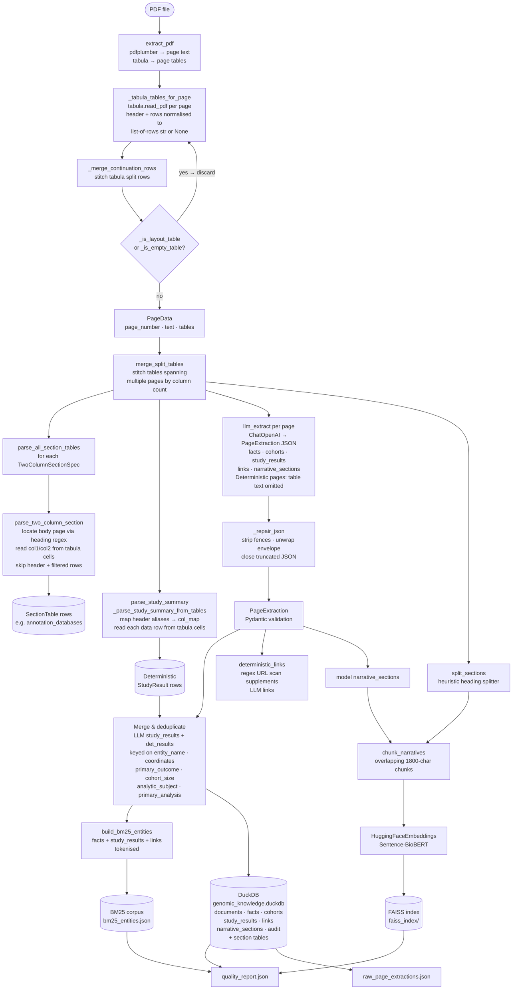

# digest_genomic_pdf

Digests a clinical genomics PDF into three complementary stores:

| Store | Content | Routing target |
|---|---|---|
| DuckDB (SQL) | Structured facts, cohorts, study results, links, section tables | ~80% |
| BM25 JSON corpus | Exact genomic identifiers (genes, rsIDs, coordinates, URLs) | ~10% |
| FAISS vector index | Narrative / methodological prose | ~10% |

> Table extraction is handled exclusively by **tabula**. OCR and text-layer table fallbacks have been removed.

---

## Workflow



---

## Key stages

1. **PDF extraction** — `pdfplumber` extracts the text layer per page. `tabula` extracts all tables per page via `_tabula_tables_for_page`. No OCR fallback.

2. **Table cleaning** — `_merge_continuation_rows` stitches tabula split-cell rows back together. Layout/navigation tables and fully-empty tables are filtered out. `merge_split_tables` stitches fragments of the same table that span consecutive pages, matched by column count.

3. **Deterministic table parsers** — two specialised parsers read directly from tabula cells, no text-layer regex:
   - `parse_all_section_tables` — iterates registered `TwoColumnSectionSpec` entries (e.g. *Variant annotation database*), locates the body page by heading regex, and reads `col1`/`col2` from tabula cells.
   - `parse_study_summary` → `_parse_study_summary_from_tables` — maps tabula header aliases to canonical field names via `_STUDY_COL_ALIASES` and reads each data row directly from cells.

4. **LLM extraction** — each `PageData` is sent to a local OpenAI-compatible server. Pages whose heading matches `_DETERMINISTIC_TABLE_HEADINGS` have table text omitted from the prompt. The model returns a `PageExtraction` JSON object; malformed output is repaired by `_repair_json` before Pydantic validation.

5. **Merge & deduplicate** — LLM and deterministic `StudyResult` rows are merged. Deduplication key: `(entity_name, genomic_coordinates, primary_outcome, cohort_size, analytic_subject, primary_analysis)`. URL links from the model are supplemented by a regex scan via `deterministic_links`.

6. **BM25 corpus** — facts, study results, and links are tokenised and written to `bm25_entities.json` for exact-match / keyword retrieval.

7. **Vector index** — narrative sections (heuristic + model) are chunked with 250-char overlap and embedded with a local Sentence-BioBERT model, then saved as a FAISS index.

8. **DuckDB** — all structured data is upserted into a local DuckDB database. `result_id` is keyed on `(page_number, entity_name, genomic_coordinates, primary_outcome, cohort_size, analytic_subject, primary_analysis)` to prevent sparse deterministic rows from overwriting rich LLM rows.

9. **Artifacts written**

   | File | Description |
   |---|---|
   | `genomic_knowledge.duckdb` | All structured tables |
   | `bm25_entities.json` | Tokenised entity corpus |
   | `faiss_index/` | FAISS vector store |
   | `vector_documents.json` | Raw chunked documents |
   | `quality_report.json` | Summary counts + warnings |
   | `raw_page_extractions.json` | Per-page text, tables, and LLM output |

---

## What was removed vs the original

| Removed | Reason |
|---|---|
| `pytesseract` / `pdf2image` / `_ocr_page_text` | OCR fallback eliminated — tabula is the sole table source |
| Text-layer regex fallback in `parse_study_summary` | Replaced entirely by tabula cell reading |
| Strategy 2 text-layer fallback in `parse_two_column_section` | Same — tabula cells only |
| `--tesseract-cmd` / `--poppler-path` CLI args | No longer needed |
| `row_re` on `TwoColumnSectionSpec` | Only used by the removed text fallback |

---

## Usage

```bash
python digest_genomic_pdf.py report.pdf \
  --source-url "https://confluence.example.org/..." \
  --output-dir genomic_digest \
  --ollama-model gemma4:e4b \
  --embedding-model /path/to/Sentence-BioBert-snli \
  --device cpu
```

Environment variables: `LLAMA_SERVER_URL`, `LLAMA_MODEL_NAME`, `OLLAMA_MODEL`, `EMBED_MODEL`, `EMBED_DEVICE`.
